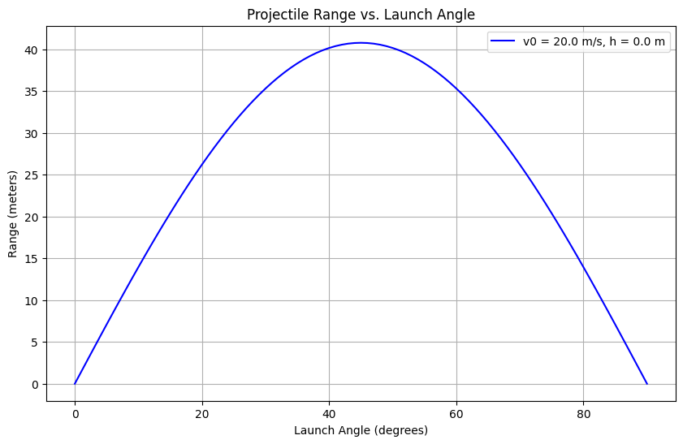

Below are detailed academic notes in Markdown format, tailored to "Investigating the Range as a Function of the Angle of Projection." These notes include a theoretical foundation with derivations, analysis of the range, and a framework for practical applications and implementation. Equations are formatted using single (`$`) or double (`$$`) dollar signs for proper LaTeX rendering.

---

# Investigating the Range as a Function of the Angle of Projection

## 1. Theoretical Foundation

Projectile motion is governed by Newton’s second law in a vacuum with constant gravitational acceleration. We assume no air resistance and a flat surface unless specified otherwise.

### Governing Equations
Consider a projectile launched with initial velocity $v_0$ at an angle $\theta$ from a height $h$ (typically $h = 0$). The acceleration is purely gravitational in the vertical direction:

- Horizontal: $a_x = 0$
- Vertical: $a_y = -g$

Using the second law, $F = ma$, and noting no horizontal forces, we write the differential equations:

$$ \frac{d^2x}{dt^2} = 0 $$
$$ \frac{d^2y}{dt^2} = -g $$

#### Initial Conditions
- At $t = 0$:
  - $x(0) = 0$, $v_x(0) = v_0 \cos\theta$
  - $y(0) = h$, $v_y(0) = v_0 \sin\theta$

#### Solving the Equations
Integrate the horizontal equation:
$$ \frac{dx}{dt} = v_0 \cos\theta $$
$$ x(t) = (v_0 \cos\theta) t $$

Integrate the vertical equation:
$$ \frac{dy}{dt} = v_0 \sin\theta - g t $$
$$ y(t) = h + (v_0 \sin\theta) t - \frac{1}{2} g t^2 $$

#### Time of Flight
The projectile lands when $y(t) = 0$. Solve:
$$ 0 = h + (v_0 \sin\theta) t - \frac{1}{2} g t^2 $$
Rearrange into a quadratic equation in $t$:
$$ \frac{1}{2} g t^2 - (v_0 \sin\theta) t - h = 0 $$
Using the quadratic formula $t = \frac{-b \pm \sqrt{b^2 - 4ac}}{2a}$ where $a = \frac{1}{2} g$, $b = -v_0 \sin\theta$, $c = -h$:
$$ t = \frac{v_0 \sin\theta \pm \sqrt{(v_0 \sin\theta)^2 + 2gh}}{g} $$
For $h = 0$, this simplifies to:
$$ t = \frac{2 v_0 \sin\theta}{g} $$

#### Range Equation
The horizontal range $R$ is the distance traveled when $y = 0$:
$$ R = x(t) = (v_0 \cos\theta) \cdot \frac{2 v_0 \sin\theta}{g} $$
Using the identity $\sin(2\theta) = 2 \sin\theta \cos\theta$:
$$ R = \frac{v_0^2 \sin(2\theta)}{g} $$
This is the range for a projectile launched and landing at the same height ($h = 0$).

### Family of Solutions
The range depends on free parameters:
- $v_0$: Initial velocity (affects $R$ quadratically).
- $\theta$: Angle of projection (via $\sin(2\theta)$).
- $g$: Gravitational acceleration (inversely proportional).
- $h$: Initial height (complicates $t$ and thus $R$).

For $h \neq 0$, the range becomes:
$$ R = (v_0 \cos\theta) \cdot \frac{v_0 \sin\theta + \sqrt{(v_0 \sin\theta)^2 + 2gh}}{g} $$

## 2. Analysis of the Range

### Dependence on Angle $\theta$
The term $\sin(2\theta)$ governs the angular dependence:
- At $\theta = 0^\circ$ or $90^\circ$, $\sin(2\theta) = 0$, so $R = 0$.
- Maximum occurs when $\sin(2\theta) = 1$, i.e., $2\theta = 90^\circ$, $\theta = 45^\circ$:
$$ R_{\text{max}} = \frac{v_0^2}{g} $$
- Symmetry: $R(\theta) = R(90^\circ - \theta)$, e.g., $R(30^\circ) = R(60^\circ)$.

### Influence of Parameters
- **Initial Velocity ($v_0$)**:
  $$ R \propto v_0^2 $$
  Doubling $v_0$ quadruples $R$.
- **Gravitational Acceleration ($g$)**:
  $$ R \propto \frac{1}{g} $$
  Lower $g$ (e.g., on the Moon, $g = 1.62 \, \text{m/s}^2$) increases $R$.
- **Initial Height ($h$)**:
  Non-zero $h$ increases time of flight, thus extending $R$. See the modified equation above.

### Example Calculation
For $v_0 = 20 \, \text{m/s}$, $g = 9.81 \, \text{m/s}^2$, $h = 0$:
- $\theta = 30^\circ$: $R = \frac{20^2 \sin(60^\circ)}{9.81} = \frac{400 \cdot 0.866}{9.81} \approx 35.3 \, \text{m}$
- $\theta = 45^\circ$: $R = \frac{400 \cdot 1}{9.81} \approx 40.8 \, \text{m}$

## 3. Practical Applications

### Real-World Scenarios
- **Sports**: A soccer ball kicked at $v_0 = 15 \, \text{m/s}$, $\theta = 30^\circ$ follows the same equations.
- **Engineering**: Artillery range depends on $\theta$ and $v_0$, adjusted for terrain ($h \neq 0$).

### Model Extensions
- **Uneven Terrain**: If landing height $h_f < h$, adjust the time of flight equation:
  $$ y(t) = h + v_0 \sin\theta t - \frac{1}{2} g t^2 = h_f $$
- **Air Resistance**: Add a drag force $F_d = -k v$, requiring numerical solutions (e.g., Euler method):
  $$ a_x = -k v_x, \quad a_y = -g - k v_y $$

## 4. Implementation Framework

### Simulation Equations
- Range: $R = \frac{v_0^2 \sin(2\theta)}{g}$ (for $h = 0$).
- Trajectory: Parametric equations $x(t)$, $y(t)$ for visualization.

### Python Pseudocode
```python
import numpy as np
import matplotlib.pyplot as plt

v0 = 20  # m/s
g = 9.81  # m/s^2
theta = np.linspace(0, 90, 91)  # degrees
R = (v0**2 * np.sin(2 * np.radians(theta))) / g

plt.plot(theta, R)
plt.xlabel("Angle (degrees)")
plt.ylabel("Range (m)")
plt.title("Range vs. Angle of Projection")
plt.show()
```

### Visualization
- Plot $R$ vs. $\theta$ for $v_0 = [10, 20, 30] \, \text{m/s}$.
- Compare $g = 9.81 \, \text{m/s}^2$ vs. $g = 1.62 \, \text{m/s}^2$.

## 5. Limitations and Extensions
- **Limitations**: Ignores air resistance, assumes constant $g$, and flat terrain.
- **Improvements**:
  - Drag: $F_d = -b v^2$ (quadratic drag).
  - Wind: Add horizontal acceleration term.

---

These notes provide a rigorous foundation with equations ready for simulation or further analysis. Let me know if you'd like a full Python script or deeper exploration of any section!

# Python Implementation



```python
import numpy as np
import matplotlib.pyplot as plt

def calculate_trajectory(v0, theta,  g=9.81, h=0):
    """
    Calculate projectile trajectory.

    Args:
    v0: initial velocity (m/s)
    theta: launch angle in degrees
    g: gravitational acceleration (m/s²)
    h: initial height (m)

    Returns:
    x: horizontal distances
    y: vertical distances
    """
    theta_rad = np.radians(theta)
    # Time of flight
    t_end = (v0 * np.sin(theta_rad) + np.sqrt((v0 * np.sin(theta_rad))**2 + 2 * g * h)) / g
    t = np.linspace(0, t_end, num=100)
    # Horizontal and vertical distances
    x = v0 * np.cos(theta_rad) * t
    y = h + v0 * np.sin(theta_rad) * t - (g/2) * t**2
    return x, y

# Parameters
v0 = 20.0  # initial velocity: 20 m/s
g = 9.81   # gravitational acceleration: 9.81 m/s²
h = 0.0    # initial height: 0 m

# Calculate trajectory for angles 0° to 90°
angles = np.linspace(0, 90, 91)
ranges = []
max_heights = []

for angle in angles:
    x, y = calculate_trajectory(v0, angle, g, h)
    ranges.append(x[-1])  # Range is the last x-value
    max_heights.append(np.max(y))  # Maximum height

# Plotting
plt.figure(figsize=(10, 6))
plt.plot(angles, ranges, 'b-', label=f'v0 = {v0} m/s, h = {h} m')
plt.grid(True)
plt.xlabel('Launch Angle (degrees)')
plt.ylabel('Range (meters)')
plt.title('Projectile Range vs. Launch Angle')
plt.legend()
plt.show()

# Find maximum range and optimal angle
max_range = max(ranges)
optimal_angle = angles[ranges.index(max_range)]
print(f"Maximum range: {max_range:.2f} m at angle: {optimal_angle:.1f}°")
```