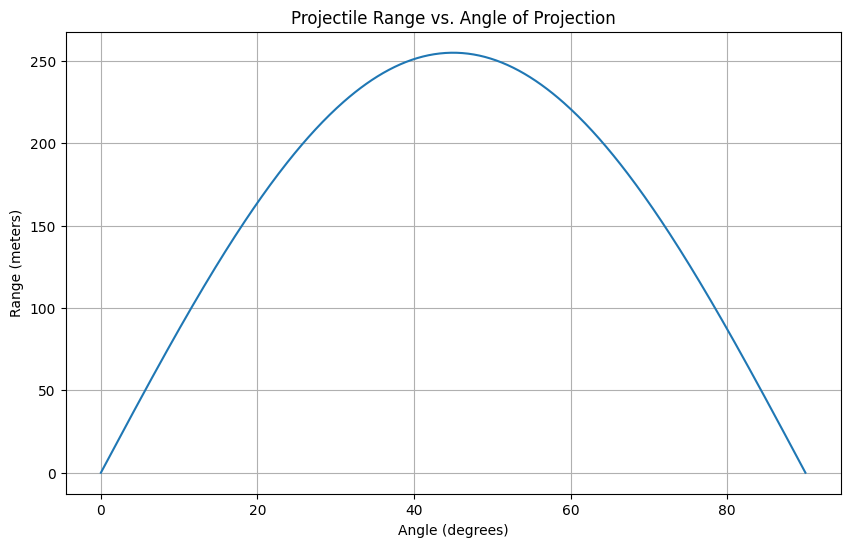

# Projectile Motion: A Comprehensive Study

## 1. Theoretical Foundation

### Deriving the Governing Equations

Projectile motion is analyzed by decomposing it into horizontal and vertical components. The key assumptions are that the only force acting on the projectile is gravity, and air resistance is ignored.

**Equations of Motion:**

1. **Horizontal Motion:**
   - $$ x(t) = v_{0x} \cdot t $$
   - $$ v_{0x} = v_0 \cdot \cos(\theta) $$

2. **Vertical Motion:**
   - $$ y(t) = v_{0y} \cdot t - \frac{1}{2} g t^2 $$
   - $$ v_{0y} = v_0 \cdot \sin(\theta) $$

**Solving for Range:**

- Time of flight $$ T $$:
  $$
  T = \frac{2 v_0 \sin(\theta)}{g}
  $$

- Range $$ R $$:
  $$
  R = \frac{v_0^2 \sin(2\theta)}{g}
  $$

### Family of Solutions

Variations in initial conditions such as $$ v_0 $$, $$ \theta $$, and $$ g $$ lead to different trajectories and ranges, forming a family of solutions.

## 2. Analysis of the Range

### Dependence on Angle of Projection

The range $$ R $$ is maximized at $$ \theta = 45^\circ $$.

### Influence of Other Parameters

- **Initial Velocity $$ v_0 $$:** Increases range quadratically.
- **Gravitational Acceleration $$ g $$:** Decreases range with stronger gravity.

## 3. Practical Applications

- **Uneven Terrain:** Adjust initial and final vertical positions.
- **Air Resistance:** Introduce drag force for more realistic trajectories.
- **Wind:** Add horizontal force to simulate wind effects.

## 4. Implementation

Below is a Python script to simulate projectile motion and visualize the range as a function of the angle of projection.

